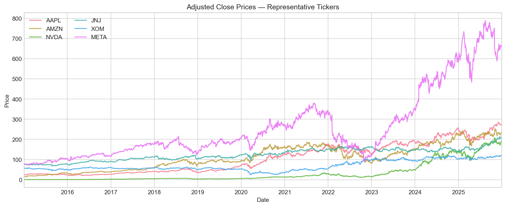
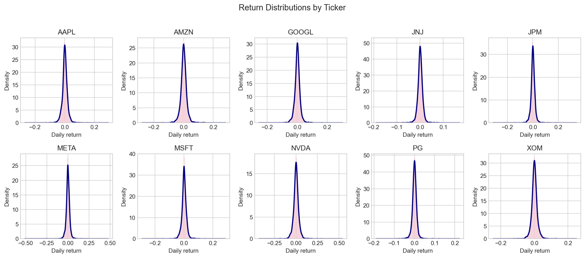
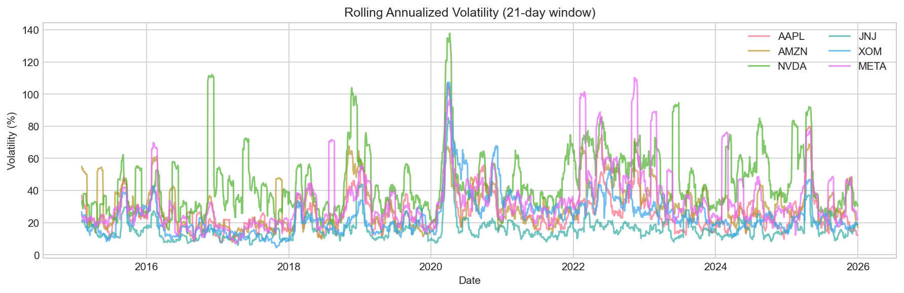
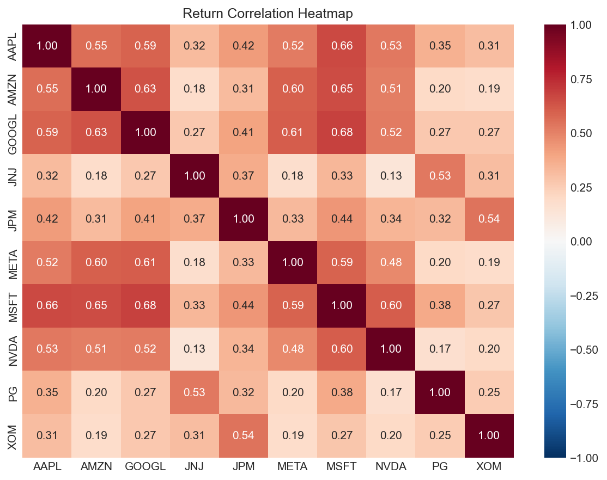
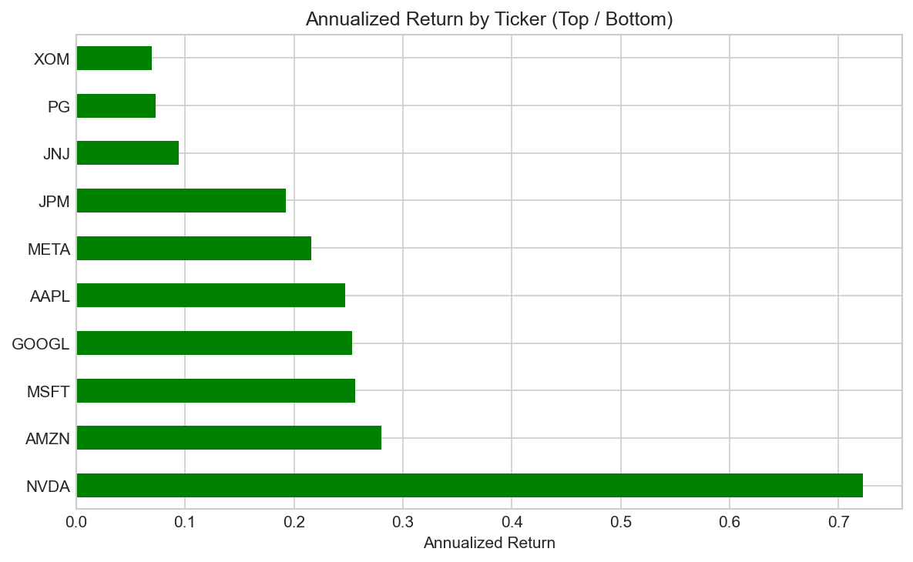
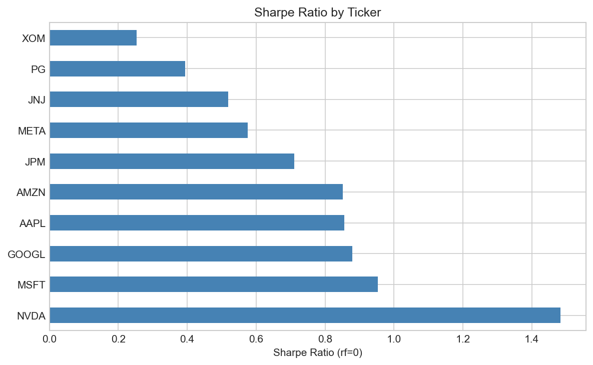
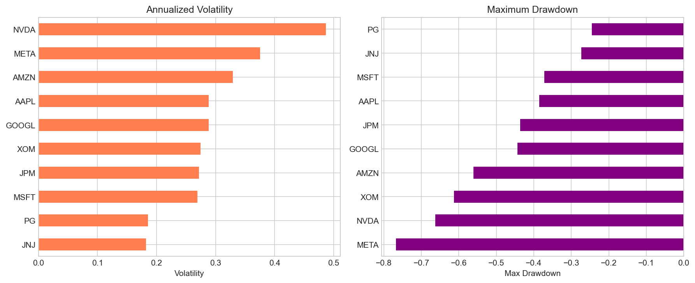
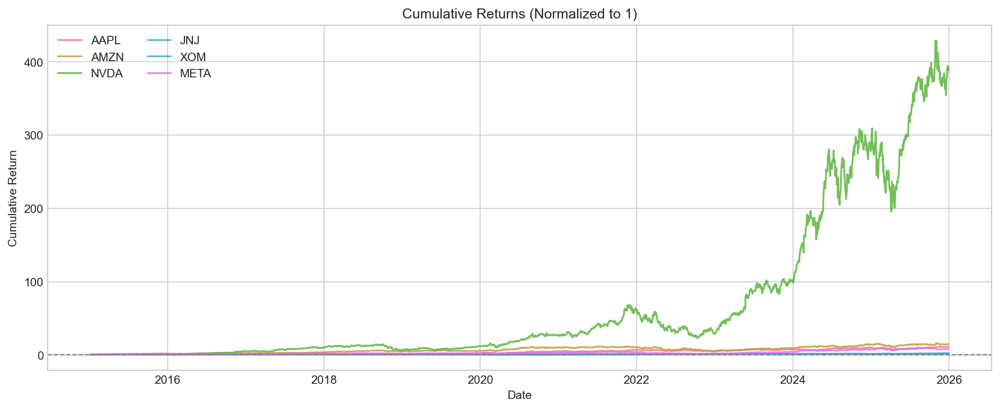
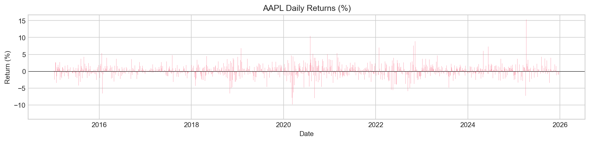
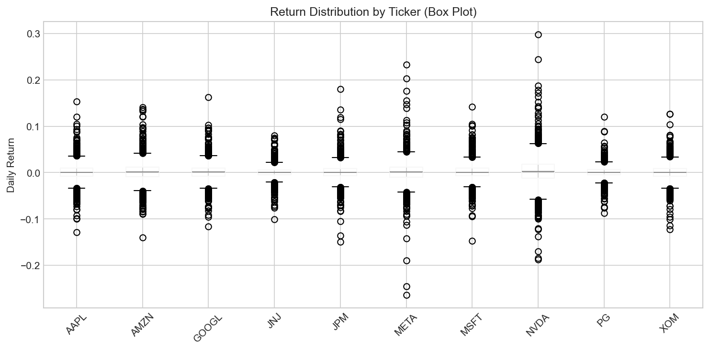

# S&P 500 股票价格探索性数据分析报告

**项目名称：** advanced-data-project  
**报告日期：** 2026-02-04  
**数据区间：** 2015-01-02 至 2025-12-30  

---

## 一、引言

### 1.1 项目背景

本报告对 S&P 500 成分股中的 10 只代表性股票进行探索性数据分析（EDA），旨在理解价格走势、收益分布、风险特征及标的间相关性，为后续投资组合优化与风险管理提供基础。

### 1.2 数据来源

| 项目 | 说明 |
|------|------|
| 数据集 | S&P 500 Stock Prices (Portfolio Optimization, 2015–2025) |
| 平台 | Kaggle |
| 数据页 | [Kaggle Dataset](https://www.kaggle.com/datasets/hiteshyadavx/s-and-p-500-stock-prices) |
| 使用文件 | `Prices.csv` |
| 下载日期 | 2026-02-04 |

### 1.3 数据格式

- **宽表结构**：行为交易日，列为日期 + 股票代码
- **数值**：调整后收盘价（Adjusted Close）
- **标的**：AAPL、AMZN、GOOGL、JNJ、JPM、META、MSFT、NVDA、PG、XOM

### 1.4 分析假设

- 无交易成本、无滑点
- 仅做多（权重 ≥ 0）
- 风险无风险利率 = 0（用于 Sharpe 比率计算）

---

## 二、数据处理流程

### 2.1 数据加载与预处理

1. **日期解析**：将 `Date` 解析为 datetime，并按日期排序
2. **缺失值检查**：统计各列缺失情况
3. **缺失值处理策略**：采用 **前向填充（Forward-fill）**
   - 理由：股价在非交易日或数据延迟时缺失，前向填充符合“最后已知价格延续”的惯常假设，有利于保留样本长度用于回测

### 2.2 收益计算

- **简单收益率**：\( r_t = (P_t - P_{t-1}) / P_{t-1} \)
- **对数收益率**：\( r_t = \ln(P_t / P_{t-1}) \)

本项目以简单收益率为主要分析对象。

### 2.3 指标定义

| 指标 | 公式 | 含义 |
|------|------|------|
| 年化收益 | 由日收益几何积推算 | 若每日复利，相当于的年化收益率 |
| 年化波动率 | 日收益标准差 × √252 | 年化后的收益波动程度 |
| Sharpe 比率 | (年化收益 − 无风险利率) / 年化波动率 | 单位风险带来的超额收益 |
| 最大回撤 | (净值 − 历史最高净值) / 历史最高净值 的最小值 | 从峰值到谷底的最大跌幅 |

---

## 三、可视化图表说明

以下每张图均保存在 `outputs/figs/` 目录下，以 PNG 格式输出。**请先运行 `notebook/eda.ipynb` 生成图片后，本报告中的图表方能正常显示。**

### 3.1 价格曲线（price_sample.png）

**含义**：展示 AAPL、AMZN、NVDA、JNJ、XOM、META 六只股票在 2015–2025 年间的调整后收盘价走势。

**可读信息**：
- 不同标的的绝对价格水平与走势差异
- 趋势方向（如 NVDA 长期上涨、XOM 波动较大）
- 可粗略判断成长股（NVDA、AMZN）与价值/能源股（JNJ、XOM）的价格路径差异

---

### 3.2 收益分布直方图（return_hist.png）

**含义**：各股票日收益率的直方图 + KDE（核密度估计）曲线。

**可读信息**：
- 日收益的分布形状（是否接近正态、是否偏态、尾部厚薄）
- 极端收益出现频率
- 不同标的的风险与收益特征差异

---

### 3.3 滚动波动率（rolling_vol.png）

**含义**：21 日滚动窗口计算的年化波动率（百分比）随时间变化。

**可读信息**：
- 波动率的时变特征（如 2020 年疫情期波动放大）
- 不同标的波动水平与稳定性
- 可用于判断高波动时期与低波动时期

---

### 3.4 回撤图（drawdown.png）

**含义**：各标的累计净值相对于历史最高净值的回撤百分比（0 表示在历史高点，负值表示相对最高点的跌幅）。

**可读信息**：
- 历史上最痛苦的下跌阶段
- 最大回撤发生的时间区间
- 不同标的的回撤深度与持续时间差异

---

### 3.5 相关性热力图（corr_heatmap.png）

**含义**：各股票日收益率之间的相关系数矩阵，颜色越红表示正相关越强，越蓝表示负相关越强。

**可读信息**：
- 哪些股票走势高度相关（分散化效果弱）
- 哪些股票相关性较低（有利于分散风险）
- 科技股之间、科技与消费/能源之间的相关性结构

---

### 3.6 年化收益排序（top_bottom_return.png）

**含义**：按年化收益率排序的横向条形图，绿色表示正收益，红色表示负收益。

**可读信息**：
- 哪只股票历史回报最高、最低
- 不同板块/行业间的收益差异

---

### 3.7 Sharpe 比率排序（sharpe_ratio.png）

**含义**：各标的的 Sharpe 比率（rf=0）排序。

**可读信息**：
- 在相同单位风险下，哪只股票收益更优
- 风险调整后收益的表现排名

---

### 3.8 波动率与最大回撤（top_bottom_metrics.png）

**含义**：左图为年化波动率排序，右图为最大回撤排序。

**可读信息**：
- 波动率最高与最低的标的
- 最大回撤最深与最浅的标的
- 便于识别“高波动+深回撤”的高风险标的

---

### 3.9 累计收益（cum_returns.png）

**含义**：将各股票初始净值设为 1，按日复利累积后的净值走势。

**可读信息**：
- 若期初投入 1 元，期末净值几何
- 不同标的的长期表现对比
- 成长路径与拐点

---

### 3.10 AAPL 日收益时间序列（return_ts_aapl.png）

**含义**：以 AAPL 为例，展示每日收益率的柱状图（正为涨、负为跌）。

**可读信息**：
- 日度波动的大小与频率
- 极端日（大涨大跌）的出现时间
- 收益序列的稳定性与聚集性

---

### 3.11 收益箱线图（return_boxplot.png）

**含义**：各股票日收益率的箱线图（中位数、四分位数、异常值）。

**可读信息**：
- 收益分布的中心与离散程度
- 离群值（极端收益）的多寡
- 不同标的的收益波动对比

---

### 3.12 风险-收益散点图（risk_return_scatter.png）

**含义**：横轴为年化波动率（风险），纵轴为年化收益，每个点代表一只股票。

**可读信息**：
- 风险与收益的权衡关系
- 哪些股票“高风险高收益”、哪些“低风险低收益”
- 在相同风险下收益更高的标的（更靠近左上）

---

## 四、主要结果

### 4.1 指标汇总（基于 outputs/metrics.csv）

| 标的 | 年化收益 | 年化波动率 | Sharpe 比率 | 最大回撤 |
|------|----------|------------|-------------|----------|
| NVDA | 72.21% | 48.70% | 1.48 | -66.34% |
| MSFT | 25.64% | 26.89% | 0.95 | -37.15% |
| GOOGL | 25.37% | 28.85% | 0.88 | -44.32% |
| AAPL | 24.71% | 28.85% | 0.86 | -38.52% |
| AMZN | 28.06% | 32.93% | 0.85 | -56.15% |
| META | 21.61% | 37.54% | 0.58 | -76.74% |
| JPM | 19.29% | 27.15% | 0.71 | -43.63% |
| JNJ | 9.44% | 18.20% | 0.52 | -27.37% |
| PG | 7.30% | 18.52% | 0.39 | -24.50% |
| XOM | 6.95% | 27.42% | 0.25 | -61.34% |

### 4.2 关键发现

1. **收益与 Sharpe**
   - **NVDA** 年化收益最高（约 72%），Sharpe 也最高（1.48），但波动和回撤均较大
   - **MSFT** 在收益与风险之间较均衡，Sharpe 达 0.95
   - **XOM**、**PG** 收益较低，Sharpe 也较低

2. **波动与回撤**
   - **META** 最大回撤最深（-76.74%），波动率也高
   - **JNJ**、**PG** 波动和回撤相对较小，偏防御型

3. **相关性**
   - 科技股（AAPL、AMZN、GOOGL、MSFT、NVDA、META）间相关性普遍较高
   - JNJ、PG 与科技股相关性较低，有利于分散风险
   - JPM 与 XOM 相关性较高（约 0.54）

---

## 五、结论与建议

### 5.1 结论

1. 数据质量良好，无明显缺失，前向填充策略在本数据集中实际影响有限
2. 科技股整体收益与波动均高于消费、能源等板块
3. NVDA 表现为高收益高波动，MSFT 在风险调整后表现突出
4. 防御型标的（JNJ、PG）波动与回撤较小，但收益较低

### 5.2 输出文件清单

| 文件 | 路径 | 说明 |
|------|------|------|
| 日收益 | outputs/returns.csv | 各标的日简单收益率 |
| 指标表 | outputs/metrics.csv | 年化收益、波动率、Sharpe、最大回撤 |
| 相关矩阵 | outputs/corr.csv | 收益率相关系数矩阵 |
| 可视化图 | outputs/figs/*.png | 共 12 张 PNG 图 |

### 5.3 后续进阶分析建议

1. **均值-方差组合优化（Markowitz）**  
   利用 returns 与 corr 估计均值和协方差，构建有效前沿，求解最大 Sharpe 或最小方差组合，并与等权、单标的对比。

2. **风险平价 / 层次风险平价（HRP）**  
   构建各资产对组合风险贡献相近的组合，或采用 López de Prado 的 HRP 方法，与均值-方差、等权组合进行回测比较。

3. **因子分解与 regime 检测**  
   对收益做因子回归（如市场因子、行业因子），分析 idiosyncratic 风险；用 HMM 或 regime-switching 识别波动 regime，并在不同 regime 下调整组合权重。

---

## 附录：图表与数据文件对应关系

| 图表 | 文件名 | 主要数据来源 |
|------|--------|--------------|
| 价格曲线 | price_sample.png | df_clean (Prices.csv) |
| 收益分布 | return_hist.png | returns |
| 滚动波动率 | rolling_vol.png | returns |
| 回撤图 | drawdown.png | returns |
| 相关性热力图 | corr_heatmap.png | returns (corr) |
| 年化收益排序 | top_bottom_return.png | metrics |
| Sharpe 排序 | sharpe_ratio.png | metrics |
| 波动率与回撤 | top_bottom_metrics.png | metrics |
| 累计收益 | cum_returns.png | returns |
| AAPL 日收益 | return_ts_aapl.png | returns |
| 收益箱线图 | return_boxplot.png | returns |
| 风险-收益散点 | risk_return_scatter.png | metrics |

---

*本报告由 EDA 分析流程自动生成，详细代码见 `notebook/eda.ipynb`。*
